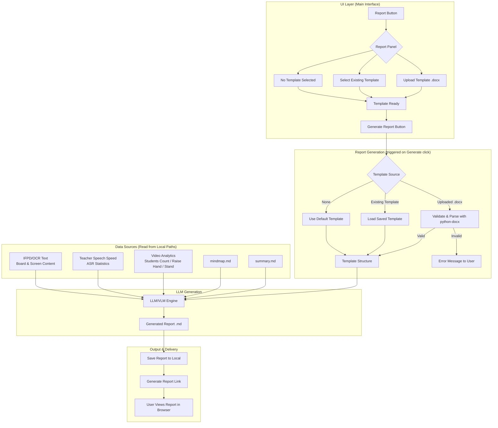
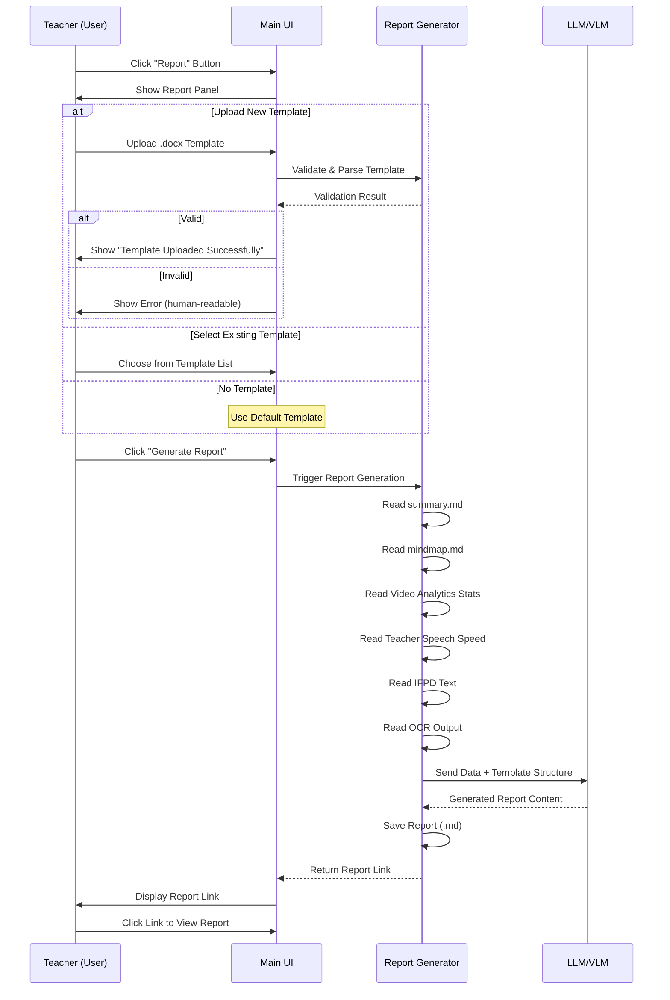
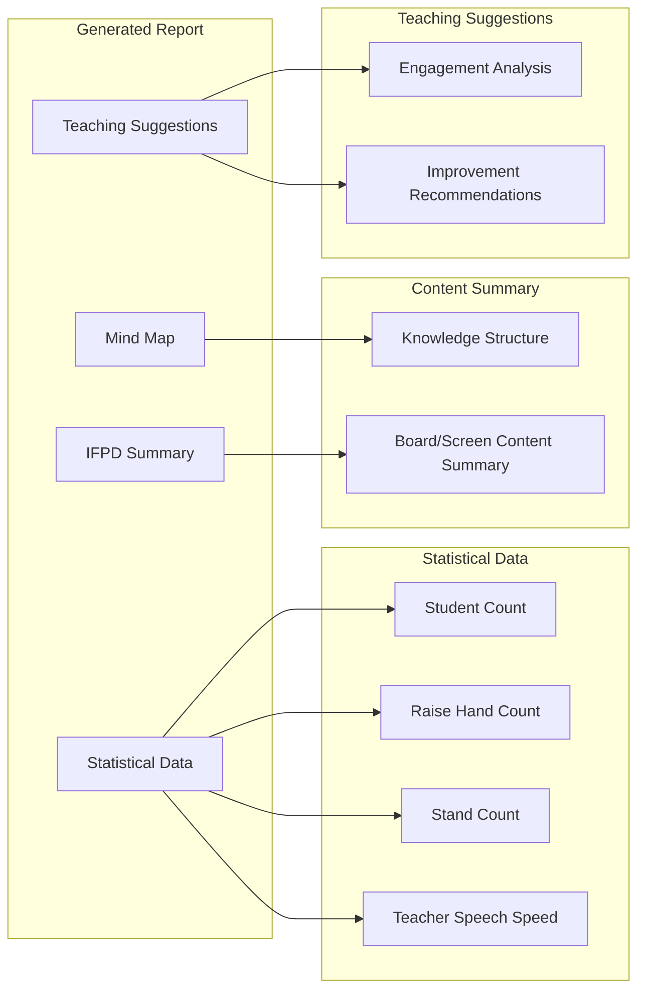

# User-Defined Template for AI Summarized Class Reports - Design

## System Architecture

## UI Workflow

## Report Content Structure

## Key Design Decisions

| Item | Decision | Reason |
|------|----------|--------|
| Template Format | .docx (Word) | Teachers are familiar with Word |
| Template Parse | python-docx -> JSON structure | Intermediate format for LLM consumption |
| Default Template | Built-in | Ensures report generation works without upload |
| Data Sources | Read from local paths | All processing on edge device, privacy preserved |
| Report Output | Markdown -> Web view | Easy to render, link shareable |
| LLM Role | Text-only generation | Fill template structure with data |

## Scope & Limitations

- Template-driven formatting only, output structure is user-controlled
- All data stays local on the edge device
- LLM/VLM reuse from existing infrastructure (#2635)
